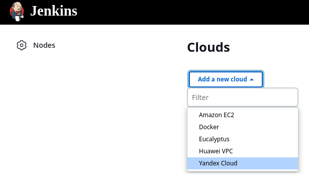
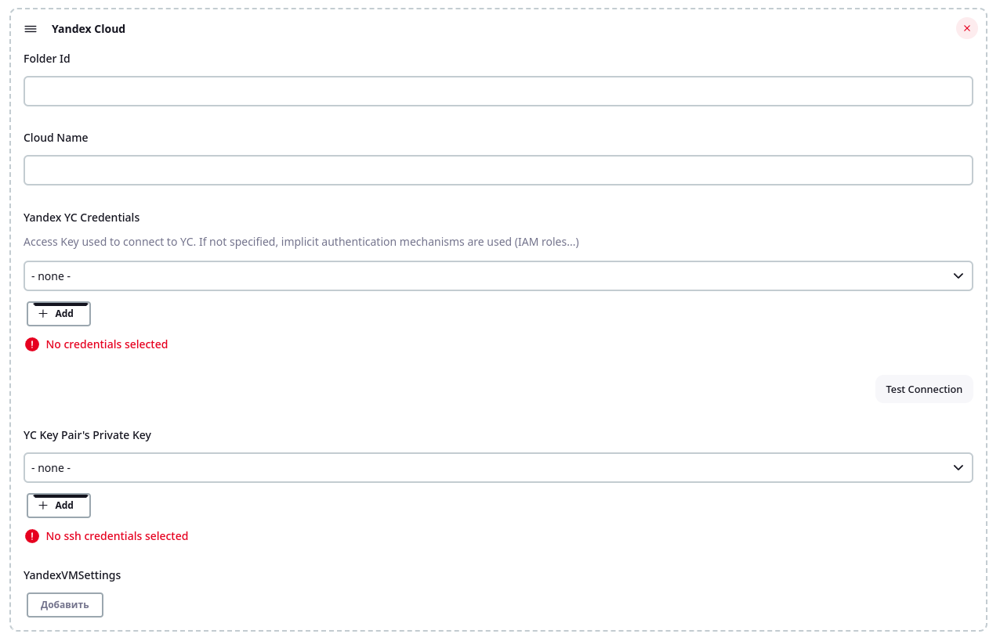
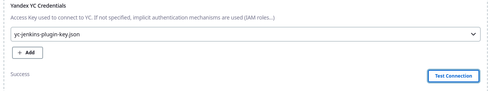
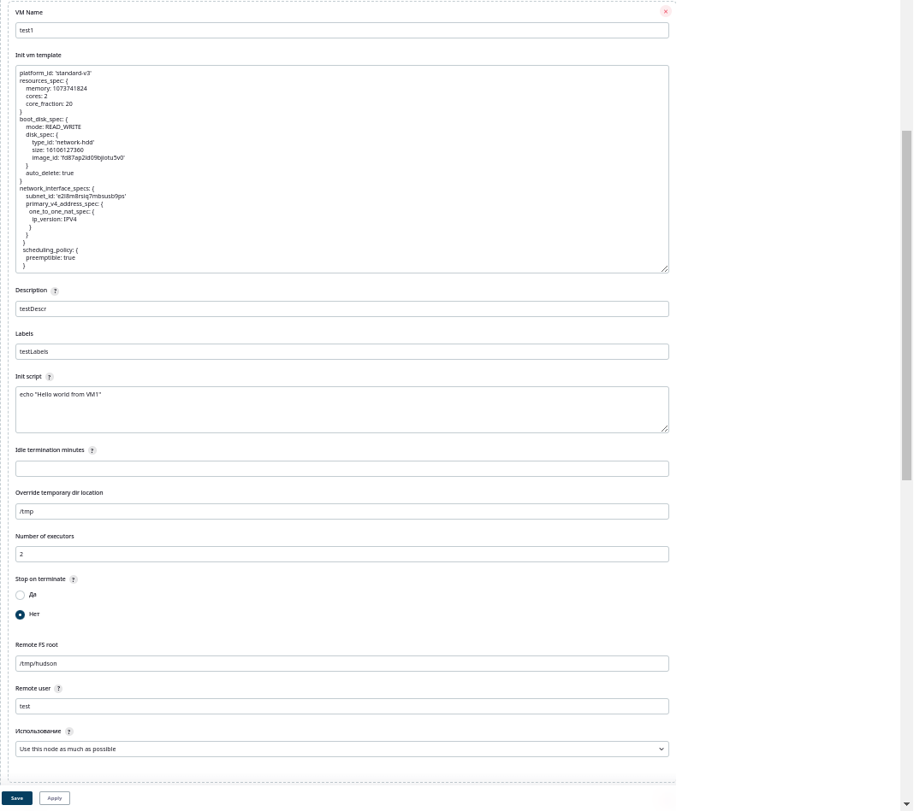

# Yandex cloud plugin for Jenkins

# Table of contents
   * [Introduction](#introduction)
   * [Usage](#usage)

# Introduction

With this plugin you can create and use virtual machine on [Yandex Cloud](https://cloud.yandex.com/en-ru/)
like agent on demand, and destroy them when they get unused. For creating and using virtual machines used
[Yandex Cloud API](https://cloud.yandex.com/en-ru/docs/compute/api-ref/)

# Usage

At first, you need sign service account on [Yandex Cloud](https://cloud.yandex.com/en-ru/).
A service account is an account that can be used by a 
program to manage resources in Yandex Cloud.
By using service accounts you can flexibly configure access 
rights to resources for programs you wrote.
Make sure the service account name is unique within your cloud. 
For more information, see [Service account](https://cloud.yandex.com/en-ru/docs/iam/concepts/users/service-accounts).
Install plugin and go to "Manage Jenkins" -> "Nodes and Clouds" -> "Clouds". 
There, you find button "Add a new cloud", and choose 
"Yandex cloud". 



After that, you can see UI form for configure your yandex cloud agent. 
To fill cloud name, folder id, select Yandex Service Account credentials, 
and YC Key Pair's Private Key. Is your private rsa key for ssh access to VM. 



When you choose service account credentials, you may test connection.
If all right, you see "success", otherwise "Failed find service account", or "Failed to login".



Next configure your Yandex Cloud VM agents. On "Yandex VM Settings" section click "Add". 
InitVmTemplate is string in the form of the following pattern.
```
 platform_id: 'standard-v3'  
 resources_spec: {
  memory: 1073741824  
  cores: 2  
  core_fraction: 20  
 }  
 boot_disk_spec: {  
  mode: READ_WRITE  
  disk_spec: {  
   type_id: 'network-hdd'  
   size: 16106127360  
   image_id: 'fd87ap2ld09bjiotu5v0'  
  }  
 auto_delete: true  
 }  
 network_interface_specs: {  
  subnet_id: 'e2l8m8rsiq7mbsusb9ps'  
  primary_v4_address_spec: {  
   one_to_one_nat_spec: {  
    ip_version: IPV4  
   }  
  }  
 }  
 scheduling_policy: {  
  preemptible: true  
 }  
```
Configuring labels that identifies jobs that could run on node created from this template. 
Multiple values can be specified when separated by space. When no labels are specified and usage mode is set to Use 
this node as much as possible, then no restrictions will apply and node will be eligible to execute any job.
Init script is the shell script to be run on the newly launched EC2 instance, before Jenkins starts launching an agent.
Here you can install packages that you need.
Idle termination minutes is minutes variables for non-stopping vm work. If empty then vm work non-stop. But, if this value is not empty, and   
"Stop on terminate" is true, vm just stop after this value time. If "Stop on terminate" is false and idle termination is not empty, vm
was destroyed.

